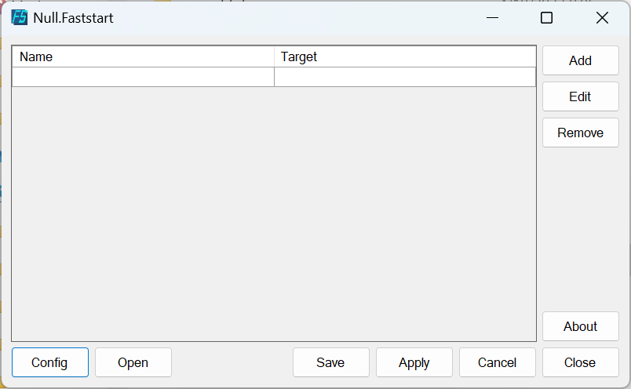

# Null.Faststart

一个快捷工具集管理工具, 设定从名称到路径的映射, 程序将自动帮你创建符号或硬链接, 并添加到 PATH 环境变量, 至此, 你便可以用通过 '运行对话框' 或着其他任何东西直接访问到你的程序, 文件或目录




## 说明

程序以 yaml 格式存储配置信息, 默认的配置文件包含以下内容:
```yaml
# 存放链接的位置
links_path: C:\WINDOWS\NFaststart
# 链接类型 Symbolic 或 Hard
links_mode: Symbolic
# 链接映射, 在这里添加键值对
links:
```

添加一个映射, 可以使用 GUI 程序编辑, 也可以直接在 links 项下添加键值对:
```yaml
links:
  me: C:\Users\SlimeNull
  translate: C:\NShare\Programs\Translator.py
```

在程序应用配置时, 将会做以下行为:
1. 清空旧的软链接并创建新的
2. 检查 PATH 环境变量, 并应用

> 这意味这, 如果您直接通过配置文件更改 links_path 节点, 旧的路径会残留在 PATH 环境变量中, 不要这么做

> 在 GUI 程序中, 应用配置同时会保存配置到配置文件

如果你已经应用过配置, 并且希望更改 links_path, 你可以
- 使用 Cli 运行 uninstall 指令
- 通过 GUI 程序在配置窗口中卸载配置

> 该操作会删除程序在 PATH 应用的路径, 并删除软链接目录.

> GUI 仅使用一个配置文件, config.yaml, 而 Cli 可以管理任意配置


## 使用

通过 Null.Faststart.Cli, 你可以方便的使用多个配置, 你也可以使用这种方式为你的工具分门别类.

```bash
# 创建 main.yaml 配置文件 (此时可以不指定拓展名)
Null.Faststart.Cli new main
# 应用 main.yaml
Null.Faststart.Cli apply main.yaml
# 卸载 main.yaml
Null.Faststart.Cli uninstall main.yaml
```

> 在创建配置时, 如果指定的文件名不以 '.yaml' 结尾, 那么程序会自动添加后缀 '.yaml'

如果你不喜欢使用 Cli 工具, 也可以使用窗体程序.
直接编译 Null.Faststart.WinForm 项目(必须使用 Release), 然后使用编译后的程序.

在程序主界面, 你可以拖动文件或目录到列表以快速添加映射, 随后你可以更改它们的名称.

单击 `应用` 来应用程序配置, 单击 `配置` 可以进入配置对话框, 在其中, 你可以卸载配置, 变更链接路径以及链接类型

## 程序集

程序的核心在 NullLib.Faststart 项目中, 该项目包含访问系统环境变量以及使用 WinAPI 创建软链接的逻辑.
Null.Faststart.Cli 是配置管理器命令行工具, 需要管理员权限才可以执行, 你可以使用它创建配置, 应用配置, 以及卸载配置.
Null.Faststart.WinForm 是管理器的 GUI 版本, 但是它依赖于 Cli, 在应用或卸载配置时, 它会调用 Cli 来实现功能.

> 之所以需要使用 Null.Faststart.WinForm 来调用 Null.Faststart.Cli, 是因为如果 GUI 程序拥有管理员权限, 那么用户将无法从没有管理员权限的普通进程中拖动文件到窗口中.